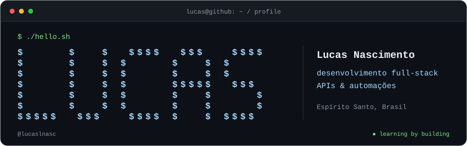

  

<h2><code>$ whoami</code></h2>

Sou <strong>Lucas Nascimento</strong>, do Espírito Santo, Brasil. Desenvolvo projetos para aprender na prática, conectando interfaces, APIs e automações.

<pre>
foco        → desenvolvimento full-stack
estudando   → IA e Playwright
desde       → 2022, transformando ideias em código
objetivo    → evoluir como desenvolvedor e contribuir com open source
</pre>

<h2><code>$ cat stack.md</code></h2>

<strong>Interfaces &amp; mobile</strong>

  

<strong>Backend</strong>

  

<strong>Bancos de dados</strong>

  
  &nbsp;
  
  &nbsp;
  

<strong>Cloud &amp; DevOps</strong>

  
  &nbsp;
  

<strong>Ferramentas, testes &amp; automação</strong>

  
  &nbsp;
  

  
Outras tecnologias que exploro

   
  

<h2><code>$ ls projects/</code></h2>

<h3><a href="https://github.com/lucaslnasc/API-Watcher">01 / API Watcher</a></h3>

Projeto de estudo para monitorar disponibilidade e latência de APIs, com verificações periódicas, eventos e cache.

<code>Java</code> <code>Spring Boot</code> <code>PostgreSQL</code> <code>Kafka</code> <code>Redis</code>

<h3><a href="https://github.com/lucaslnasc/NexTI-API">02 / NexTI API</a></h3>

API para gerenciar chamados, interações e histórico de atendimento, com integração a automações via webhooks.

<code>TypeScript</code> <code>Node.js</code> <code>Fastify</code> <code>Supabase</code> <code>n8n</code>

<h3><a href="https://github.com/lucaslnasc/task-flow">03 / TaskFlow</a></h3>

Gerenciador de tarefas em Flutter, com backend local em Dart para autenticação e organização das tarefas.

<code>Flutter</code> <code>Dart</code> <code>shelf</code>

<a href="https://github.com/lucaslnasc?tab=repositories">Explorar todos os repositórios →</a>

<h2><code>$ ./contributions.sh</code></h2>

  

<a href="https://github.com/lucaslnasc?tab=overview">Ver atividade no GitHub</a>

<h2><code>$ cat contact.txt</code></h2>

  <a href="https://www.linkedin.com/in/lucas-nascimento-6592a4261/">LinkedIn</a>
  &nbsp; / &nbsp;
  <a href="mailto:lucaslnascimento090@gmail.com">E-mail</a>
  &nbsp; / &nbsp;
  <a href="https://github.com/lucaslnasc">GitHub</a>

<samp>Aprendendo, construindo e melhorando um projeto de cada vez.</samp>

